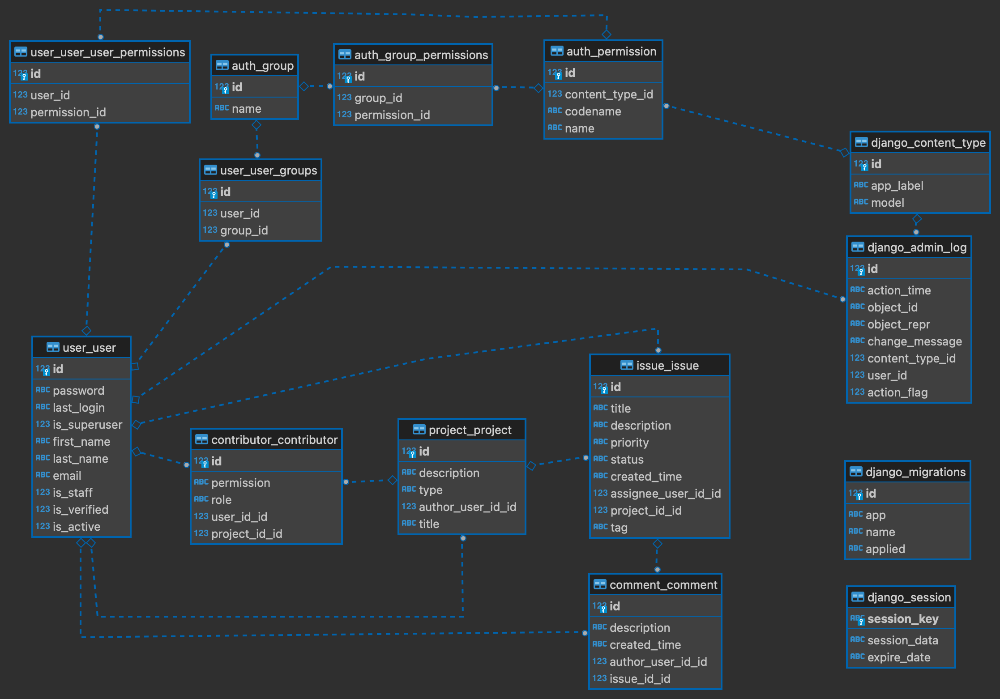

# Project 10: SoftDesk / Create a secured API with DRF

Menu

1. Usage
2. Entity–relationship model
3. Technologies
4. Installation
5. Execution of the program
6. flake8 report
7. Important information about the database
8. API Documentation

## 1 - Usage

API for an Issue Tracking System

## 2 - Entity–relationship model  
  
### simplified view  
  

  
### detailed view  
  

  
## 3 - Technologies

Programming language:   

Frameworks:  
  
  

Database:   

## 4 - Installation

You need to have Python installed on your machine. [install python](https://www.python.org/downloads/)  
You need to have Git installed on your machine. [install git](https://git-scm.com/book/en/v2/Getting-Started-Installing-Git)  
  
Open a terminal wherever you want then follow these steps:  

- Clone the repository:  

```python
git clone https://github.com/RafaRemote/DAPY_P10_softDesk.git
```

- Move to the root folder:  

```python
cd DAPY_P10_softDesk
```

- Install the virtual environment:  

```python
python3 -m venv env
```

or on windows: py -m venv env  

- Activate the virtual environment:  

```python
source env/bin/activate
```

or on windows: env\Scripts\activate  

- Upgrade pip:  

```python
pip install --upgrade pip
```

- Install the project dependencies:  

```python
pip install -r requirements.txt
```

## 5 - Execution of the program

From the terminal, be sure to be in the root folder (named 'DAPY_P10_softDesk'), then type:  

```python
python manage.py runserver
```

Development server starts at: [http://127.0.0.1:8000/](http://127.0.0.1:8000)  

## 6 - flake8 report

In the root folder (named: 'DAPY_P10_softDesk') you'll find a folder called: 'flake8_report', including an index.html showing 'no flake8 violations'.  

To generate a new report:  

erase the folder 'flake8_report'.  
be sure to be in the root folder 'litreview', then type:  

```python
flake8 --format=html --htmldir=flake8_report
```

## 7 - Important information about the database

The database is empty.  

If you want to create a superuser to access the default Django adminstration page, follow these instructions:

Open a second terminal. (first one is running the script).  
Type:

```python
python manage.py createsuperuser
```

Follow the instructions, once the superuser created you can access the default Django adminstration page and log in with your freshly created credentials @ [http:127.0.0.1:8000/admin/](http://127.0.0.1:8000/admin/).  
  
## 8  POSTMAN API Documentation

[postman api documentation](https://documenter.getpostman.com/view/12917774/UVC2HpH6)
